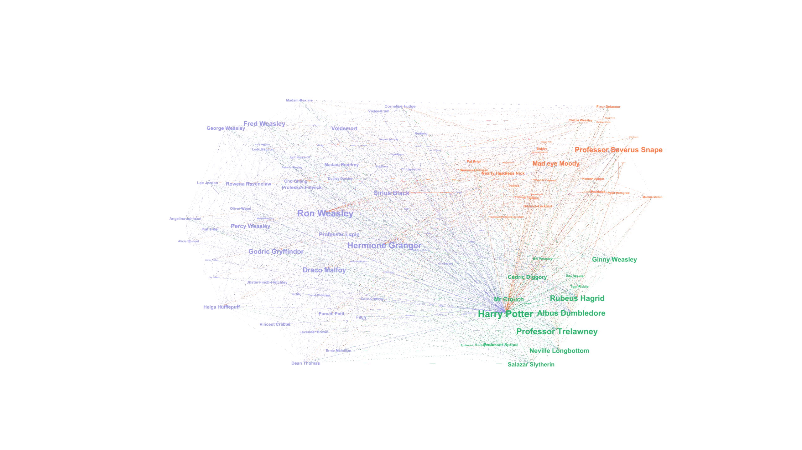
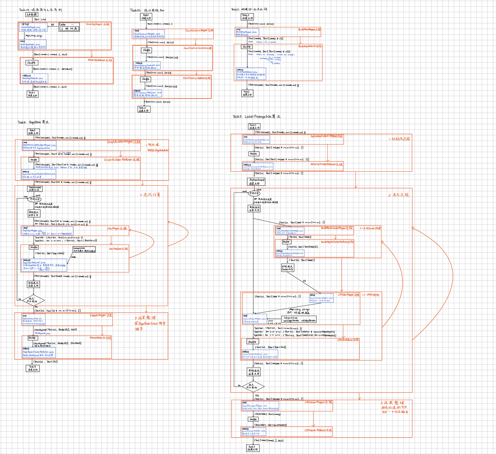

# `ACR(📚️)=>🕸️`

<p align="center">
    <a href="#quick-start">🔥Quick Start</a>-
    <a href="#components">⚙️Components</a>-
<!--    <a href="#-Document">📕Document</a>- -->
    <a href="./CHANGELOGS.md">📙Changelogs</a>-
    <a href="#contributors">🧑Contributors</a>-
    <a href="#license">📄License</a>
</p>

<p align="center">
    
    
    
	</br>
    
    
    
    
    
    
</p>

## 🔥Quick Start

This project aims to analyse character relationships (including importance of each character, community detection) from massive texts based on Apache Hadoop. And we have already applied it to the《Harry Potter》.

In order to more easily run each components, this project bases on configuration. You can use different `.yaml` configuration files for different running only with once building.

Build this project by maven in the project root folder:

```bash
mvn clean package
```

Run specific subtask/component by one of order with specific main class and configuration file below:

```bash
hadoop jar MP-Lab1.jar potternet.GetNameSeq.GetNameSeqMain task1_conf.yaml
hadoop jar MP-Lab1.jar potternet.CountCooccurence.CountCooccurMain task2_conf.yaml
hadoop jar MP-Lab1.jar potternet.BuildCharacterMap.BuildMapMain task3_conf.yaml
hadoop jar MP-Lab1.jar potternet.ComputePageRank.PageRankMain task4_conf.yaml
hadoop jar MP-Lab1.jar potternet.SyncLabelPropagation.SyncLPAMain task5_conf.yaml
```

And each task’s configuration file demo has already exists in the project root folder, please refer them to write your own `.yaml` configuration file for specific subtask.😀

<p align="center">
    
    
</p>


<p align="center">
    
</p>


## ⚙Components

1. `potternet.GetNameSeq`: extract character’s name sequence from input text data.
2. `potternet.CountCooccurence`: count the co-occurrence of names in the same sentence.
3. `potternet.BuildCharacterMap`: deal last task’s output by normalization, and build a directed weighted graph which expresses the relationship net.
4. `potternet.ComputePageRank`: apply the PageRank algorithm to the relationship net, and sort characters by PageRank value (importance factor).
5. `potternet.SyncLabelPropagation`: do community detection according to the relationship net


## 🧑Contributors

[@pawx2](https://github.com/pawx2)

## 📄License

This project is licensed under the [GNU GPL3](./LICENSE).