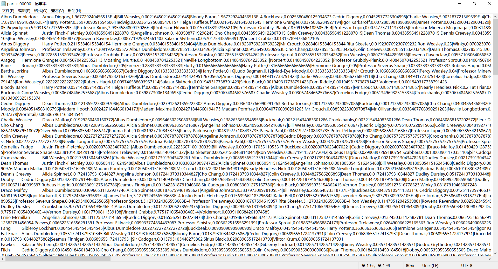
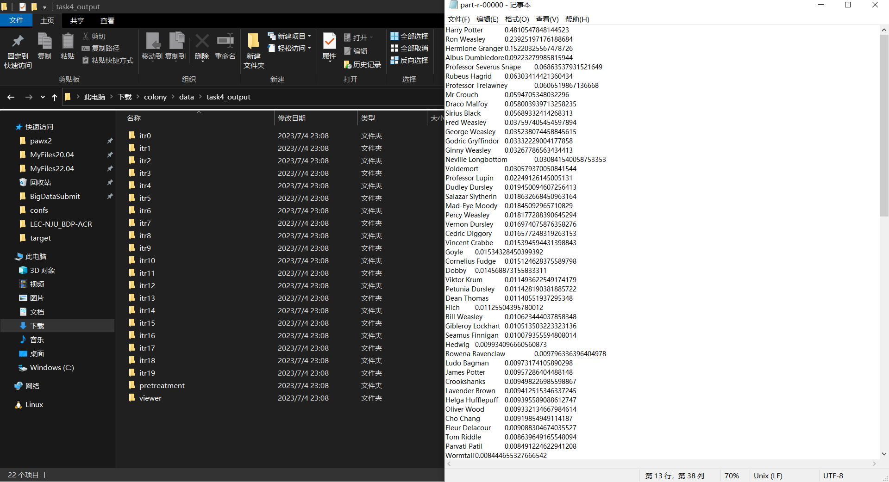

# 数据综合大实验报告

> **实验选题**：2.哈利波特的魔法世界
> **完成时间**：2023/07/04
> **小组成员**：张乃仁(201870048)【组长】, 钟亚晨(201220096), 聂冠华(201220147), 陈毅埼(201220167)

## 概览

------

**摘要**

- 基于Apache Hadoop大数据处理框架，使用SnakeYaml配置化运行，maven构建项目
- 使用诸如同现频率统计、PageRank算法、LabelPropagation算法
- 对《哈利·波特》系列书籍分析其中人物重要性排序、划分社区。

**研究问题背景**

- 《哈利·波特》系列书籍包含大量文本和人物，可使用Apache Hadoop框架处理大量数据，统计获得其中人物重要性排序、划分社区
- 针对每个句子中的人物名称出现次序，可以提取、统计人物同现Pair，进而建立一个归一化的有向带权图描述人物间关系
- PageRank是Google搜索引擎用于评估网页重要性的著名算法，而针对人物关系网统计人物重要性排序是一个等价问题
- LabelPropagation是一个社区发现算法，适用于对人物关系网进行社区划分

**参考文献**
- [PageRank算法](http://web.mit.edu/6.033/2004/wwwdocs/papers/page98pagerank.pdf)：The PageRank Citation Ranking: Bringing Order to the Web
- [LabelPropagation算法](https://journals.aps.org/pre/abstract/10.1103/PhysRevE.76.036106)：Near linear time algorithm to detect community structures in large-scale networks

**完成情况**

四项基本任务 + 两项选做任务，全部完成。

- 基本任务
    - [x] Task01-提取每句人名序列
    - [x] Task02-统计同现Pair
    - [x] Task03-构建关系网
    - [x] Task04-PageRank算法，分析人物重要性
- 选做任务
  - [x] Extend01-PageRank算法结构排序，依据PageRankValue降序排序
  - [x] Extend02/Task05-LabelPropagation实现
- 其它任务
    - [x] Task01-Task05-串联执行
    - [x] Task04、05-可视化演示

## 课题小组分工

------

**张乃仁**：1. Task1/4/5功能实现与优化；2. 调试平台文件访存；

**钟亚晨**：1. Task1~Task5功能设计与实现；2. 实验报告撰写；

**聂冠华**：1. 代码修正(fix bug)；2. 实验报告撰写；

**陈毅埼**：1. Task1→Task5串行执行顶层模块实现；2. Task4、Task5结果可视化演示；

## 运行本项目

------

**前置准备**
- 本项目使用`.yaml`配置化运行，需在平台上上传包含所有配置文件的`./src/confs`文件夹。
- 需上传`./src`下IDEA项目使用maven构建的`MPLab-1.jar`程序包。

**依赖关系**

运行特定任务需运行其前置任务，任务依赖关系如下图：

<p align="center">
    
</p>

**运行任务**

在平台命令提交中执行下述指令可分别运行任务：

```bash
# Task1: 以句子为单位，提取人名序列
MPLab-1.jar potternet.GetNameSeq.GetNameSeqMain /home/2023stu22/confs/task1_conf.yaml
# Task2: 统计人名同现Pair
MPLab-1.jar potternet.CountCooccurrence.CountCooccurMain /home/2023stu22/confs/task2_conf.yaml
# Task3: 构建归一化关系网
MPLab-1.jar potternet.BuildCharacterMap.BuildMapMain /home/2023stu22/confs/task3_conf.yaml
# Task4: PageRank算法，获取人物重要性降序排序
MPLab-1.jar potternet.ComputePageRank.PageRankMain /home/2023stu22/confs/task4_conf.yaml
# Task5: LabelPropagation算法，对人物关系网进行社区划分
MPLab-1.jar potternet.SyncLabelPropagation.SyncLPAMain /home/2023stu22/confs/task5_conf.yaml
# 串行执行上述所有任务
MPLab-1.jar potternet.UpperModule.UpperModuleMain /home/2023stu22/confs/task_conf.yaml
```

## 技术难点

------

1. 人名列表的歧义消除；
2. Hadoop迭代任务实现PageRank算法及LabelPropagation算法；
3. 合理地使用MapReduce执行可并行部分；

## 设计方法及思路

------

> 本节所给流程设计图中各个函数的详细设计、实现可在下节“**详细设计说明**”中查找对应内容。

**整体设计**

分析各个Task的任务流程，确定可并行部分，并对其使用MapReduce：
1. Task01-提取每句人名序列：输入文本的每一句之间无相互依赖，每个句子提取人名序列的部分可并行计算；
2. Task02-统计同现Pair：每个单独的人名序列间无相互依赖，同现Pair的构造仅依赖于同一句子的人名序列，可并行计算；
3. Task03-构建归一化关系网：

### 外围辅助模块

**模块信息**
- `potter.UpperModule`
    - 作用：提供串联执行Task01-Task05的顶层接口
    - 结构：`UpperModuleMain.java`
- `potter.ConfReader`
    - 作用：利用SnakeYaml实现配置化运行，解析`.yaml`配置文件中各项配置
    - 结构：`ConfReader.java`

### Task01-提取每句人名序列

**模块信息**
- 位置：`potternet.GetNameSeq`
- 结构：
  1. 顶层模块：提供main接口，读入配置文件，组织构造MapReduce任务
     - `GetNameSeqMain.java`
  2. 人名序列提取：MapReduce任务，并行处理，从句子中提取人名序列
     - `NameSeqMapper.java` | `NameSeqReducer.java`

**工作流程设计**

<p align="center">
    
</p>


### Task02-统计同现Pair

**模块信息**
- 位置：`potternet.CountCooccurrence`
- 结构：
  1. 顶层模块：提供main接口，读入配置文件，组织构造MapReduce任务
     - `CountCooccurMain.java`
  2. 统计同现Pair：MapReduce任务，并行处理，从人名序列中统计同现Pair
     - `CountCooccurMapper.java` | `CountCooccurCombiner.java` | `CountCooccurReducer.java`

**工作流程设计**

<p align="center">
    
</p>


### Task03-构建归一化关系网

**模块信息**
- 位置：`potternet.BuildCharacterMap`
- 结构：
  1. 顶层模块：提供main接口，读入配置文件，组织构造MapReduce任务
     - `BuildMapMain.java`
  2. 生成归一化关系网：MapReduce任务，并行处理，Mapper节点构建带权边，Reducer聚合后进行归一化和邻接表项生成
     - `BuildMapMapper.java` | `BuildMapReducer.java`

**工作流程设计**

<p align="center">
    
</p>


### Task04-PageRank算法

**模块信息**
- 位置：`potternet.ComputePageRank`
- 结构：
    1. 顶层模块：提供main接口，读入配置文件，组织构造MapReduce任务
        - `PageRankMain.java`
    2. 初始化：MapReduce任务，读入关系网，初始化各节点PageRankValue为1
        - `PageRankGraphBuilderMapper.java` | `PageRankGraphBuilderReducer.java`
    3. 迭代过程：MapReduce任务，依据关系网结构更新各个节点PageRankValue
        - `PageRankIterMapper.java` | `PageRankIterReducer.java`
    4. 结果处理：依据PageRankValue降序排序结果
        - `PRVPayload.java` | `PageRankViewerMapper.java` | `PageRankViewerReducer.java`

**工作流程设计**

<p align="center">
    
</p>


### Task05-LabelPropagation算法

**模块信息**
- 位置：`potternet.SyncLabelPropagation`
- 结构：
    1. 顶层模块：提供main接口，读入配置文件，组织构造MapReduce任务
        - `SyncLPAMain.java`
    2. 初始化：MapReduce任务，读入关系网，初始化各节点唯一标签
        - `SyncLPASetUniqueLabelMapper.java` | `SyncLPASetUniqueLabelReducer.java`
    3. 迭代过程：构建标签映射表Cache + LPA同步更新
        - 构建标签映射表：`SyncLPABuildMapAsCacheMapper.java` | `SyncLPABuildMapAsCacheReducer.java`
        - LPA同步更新：`SyncLPAIterMapper.java` | `SyncLPAIterReducer.java`
    4. 结果处理：依据标签划分社区，整理最终
        - `SyncLPAViewerMapper.java` | `SyncLPAViewerReducer.java`

**工作流程设计**

<p align="center">
    
</p>


## 详细设计说明

------

### Task01-提取每句人名序列

**任务总览**
- 输入：小说文集和小说人名列表
- 输出：按句为单位提取的一系列人名序列，format: `<name1>[,<name>]...`

#### 0.顶层模块-GetNameSeqMain.java

**GetNameSeqMain-main**
- 函数原型：
    ```java
    public static void main(String[] args) throws Exception
    /**
    * @param args: a terminal parameter, which is the path to the .yaml configuration file
    * @note: config a Hadoop MapReduce job, whose input is: a name list, some text files,
    * output is: a name sequence store in a text file by format: "<name1>,<name2>,<name3>...\n",
    * and each line corresponds to a sentence.
    */
    ```
- 功能：
  - 利用`addCacheFile`函数将人名列表文件作为缓存提供给各个Mapper节点
  - 组织配置MapReduce任务

#### 1.提取人名序列-GetNameSeqMapper/Reducer.java

```java
public class NameSeqMapper extends Mapper<LongWritable, Text, Text, NullWritable>
public class NameSeqReducer extends Reducer<Text, NullWritable, Text, NullWritable>
```

**GetNameSeqMapper.java-map**
- 函数原型：
    ```java
    public void map(LongWritable key, Text value, Context context) throws IOException, InterruptedException
    /**
    * Scan text and extracting name chains from sentences, each sentence corresponds to a line data,
    * whose format is: "<name1>,<name2>,<name3>,...\n"
    */
    ```
- 功能：
    - 依赖同文件、同类下的`setup`函数对名单列表进行冲突消除
    - 从文本数据中读入每行/句子，提取该句中人名序列
- 实现说明：
    1. 在mapper类的setup函数创建一个字典，这个字典首先硬编码地加入若干项，用于将人名统一化处理，即把`key`统一化为`value`。然后再读入`person_name_list.txt`文件，对于其中的每个人名`name`：
        - 如果`name`中含有空格，首先向字典中加入`<name,name>`项。然后用空格分词，对得到的每个子串`token`，如果字典中现在没有`key`为`token`，向字典中加入`<token,name>`。
        - 否则，将`name`加入`Set<String> characters`中
        最后，对于`characters`中的每个`name`，如果`name`不在字典的`key`中，向字典中加入`<name,name>`
    2. 在`map`函数中首先将每行中的非英文字母、非连字符替换为空格。再用空格进行分词得到一个字符串数组。
    3. 使用滑动窗口提取人名（由于人名列表中人名最大长度为3，滑动窗口最大长度也是3）
- 伪代码：
    ```java
        // nameDict为setup函数中构造出的字典
        List<String> item
        left = 0
        right = min(2, words.length - 1);
        while left < words.length :
            i = right
            for i =right to left :
                str = words[left:i] //闭区间
                if str in nameDict.key:
                    item.add(nameDict[str]);
                    break
            if i < left:
                left++
            else :
                left = i+1
            right = min(2, words.length - 1);
        emit(string(item),null)
    ```

**GetNameSeqReducer.java-reduce**
- 函数原型：
    ```java
    public void reduce(Text key, Iterable<NullWritable> values, Context context) throws IOException, InterruptedException
    /**
     * do nothine
    */
    ```
- 功能：
    - 不做处理，按原样输出

### Task02-统计同现Pair

**任务总览**
- 输入：Task1获得的人名序列文件，format：`<name1>[,<name>]...`
- 输出：统计出的人物同现Pair，format：`<name1>,<name2>\t<frequency>`

#### 0.顶层模块-CountCooccurMain.java

**CountCooccurMain-main**
- 函数原型：
    ```java
    public static void main(String[] args) throws Exception
    /**
    * @param args: a terminal parameter, which is the path to the .yaml configuration file
    * @note: config a Hadoop MapReduce job, whose input is: a name sequence list
    * output is: a list of co-occurrence names pair
    */
    ```
- 功能：
    - 配置Combiner
    - 组织配置MapReduce任务

#### 1.统计人物同现Pair-CountCooccurMapper/Combiner/Reducer.java

```java
public class CountCooccurMapper extends Mapper<LongWritable, Text, Text, IntWritable>
public class CountCooccurCombiner extends Reducer<Text, IntWritable, Text, IntWritable>
public class CountCoocurReducer extends Reducer<Text, IntWritable, Text, IntWritable>
```

**CountCooccurMapper.java-map**
- 函数原型：
    ```java
    public void map(LongWritable key, Text value, Context context) throws IOException, InterruptedException
    ```
- 功能：
    - 从读入的人名序列中统计同现Pair
- 实际实现：
    ```java
    // Get name sequence and analysis name pairs
    String[] names = value.toString().split(",");
    for(String name1 : names) {
        for(String name2 : names) {
            if(!name1.equals(name2)) {
                context.write(new Text(name1 + "," + name2), new IntWritable(1));
            }
        }
    }
    ```

**CountCooccurCombiner.java-reduce**
- 函数原型：
    ```java
    public class CountCooccurCombiner extends Reducer<Text, IntWritable, Text, IntWritable>
    /**
    * Use combiner as the local reducer to optimize MapReduce Job performance
    */
    ```
- 功能：
    - Mapper节点聚合本地相同`key`的键值对，减少网络传输

**CountCooccurReducer.java-reduce**
- 函数原型：
    ```java
    public void reduce(Text key, Iterable<IntWritable> values, Context context) throws IOException, InterruptedException
    /**
    * result format: "<name1>,<name2>\t<co-occurrence times>"
    */
    ```
- 功能：
    - Reducer节点聚合全局相同`key`的键值对，生成正确的同现频次统计结构

### Task03-构建归一化关系网

**任务总览**
- 输入：Task2输出的人物同现统计，format：`<name1>,<name2>\t<frequency>`
- 输出：邻接表表示的带权有向图，表示人物关系网，format：`<out_node>\t<in_node>,<weight>[|<in_node>,<weight>]...`

#### 0.顶层模块-BuildMapMain.java

**BuildMapMain-main**
- 函数原型：
    ```java
    public static void main(String[] args) throws Exception
    /**
    * @param args: a terminal parameter, which is the path to the .yaml configuration file
    * @note: config a Hadoop MapReduce job, whose input is a list data with format: "<name1>,<name2>\t<co-occurrence times>"
    * output is: a file which expresses an adjacency list with format:
    * "<begin_name/node>:\t<end_name1/node1>,probability[|<end_name/node>,probability]..."
    */
    ```
- 功能：
    - 组织配置MapReduce任务

#### 1.构建归一化关系网-BuildMapMapper/Reducer.java

```java
public class BuildMapMapper extends Mapper<LongWritable, Text, Text, Text>
public class BuildMapReducer extends Reducer<Text, Text, Text, Text>
```

**BuildMapMapper-map**
- 函数原型：
    ```java
    public void map(LongWritable key, Text value, Context context) throws IOException, InterruptedException
    /**
    * @inputFormat: "<name1>,<name2>\t<times>"
    * @outputFormat: "(<out_node/name>, <in_node/name # frequency>)"
    */
    ```

**BuildMapReducer-reduce**
- 函数原型：
    ```java
    public class BuildMapReducer extends Reducer<Text, Text, Text, Text>
    /**
    * input pair format: "<<out_node>, [<in_node1>#<frequency>, <in_node2>#<frequency>,...]>"
    * result format: "<out_node/name>\t<in_node/name1>,<frequency>[|<in_node/name>,<frequency>]..."
    */
    ```
- 实现说明：
    - 对于每个输入键值对，`key`一定唯一出现。只需用此键值对即可算出`out_node`各个出边对应端点及各边的归一化权重。
- 伪代码：
    ```java
        ArrayList<Pair<String, Double>> recorder = new ArrayList<>();
        sum_frequency = 0;
        for  val : values 
            对val进行分词得到in_node和其对应的frequency
            sum_frequency += frequency
            recorder.add(<in_node,frequency>)
        string result
        for <in_node, frequency> : recorder
            probability = frequency / sum_frequency;
    
            if result == "":
                result = in_node + string(probability)
            else :
                result += "|" + in_node + string(probability)
        emit(key,result)
    ```

### Task04-PageRank算法

**任务总览**
- 输入：Task3输出结果，邻接表表示的人物关系网，format：`<out_node>\t<in_node>,<weight>[|<in_node>,<weight>]...`
- 输出：运行PageRank算法后，依照PageRankValue降序排序的名单列表

**实现说明**

使用3类MapReduce任务串行执行进行实现：
1. `PageRankGraphBuilder`：初始化每个节点的pangerank值为1
2. `PageRankIter`：更新每个节点的pangrank值（迭代过程）
3. `PageRankViewer`：按照指定格式输出节点

#### 0.顶层模块-PageRankMain.java

**PageRankMain-main**
- 函数原型：
    ```java
    public static void main(String[] args) throws Exception {
    /**
    * @param args: a terminal parameter, which is the path to the .yaml configuration file
    * @note: config a Hadoop MapReduce job, whose input is a file which expresses an adjacency list with format:
    * "<begin_name/node>:\t<end_name1/node1>,probability[|<end_name2/node>,<probability>]..."
    * this job is a iterated task which finishes a PageRank Computing
    */
    ```
- 功能：
    - 从`.yaml`配置文件中读入阻尼因子、迭代次数等参数，加载到`Configuration`以供Mapper和Reducer使用
    - 组织配置MapReduce任务执行流程
- 伪代码：
    ```java
    设置启动第一步MapReduce预处理任务
    // 下面是第二步的
    itrMaxNum    // 最大迭代轮数，在task4_conf.yaml文件中配置
    itrDoneNum=0 //当前迭代轮数
    while itrDoneNum < itrMaxNum:
        if itrDoneNum == 0 : //第一次迭代
            输入设置为上一步reduce的输出
        else :
            输入设置为上一轮迭代的reduce的输出
        设置启动第二步的map和reduce
        if itrDoneNum > 1 :
            if 本轮迭代结果与上轮迭代结果相同 ：
                break
        itrDoneNum += 1
    设置启动第三步的map和reduce，得到task4的结果
    ```

#### 1.预处理：初始化PageRank-PageRankGraphBuilderMapper/Reducer.java

```java
public class PageRankGraphBuilerMapper extends Mapper<LongWritable, Text, Text, Text>
public class PageRankGraphBuilerReducer extends Reducer<Text, Text, Text, Text>
```

**PageRankGraphBuilderMapper-map**

```java
public void map(LongWritable key, Text value, Context context) throws IOException, InterruptedException {
/**
* @note: PageRank Algorithm implementation in Hadoop Mapper
* @input: format: "<out_node/name [u]>\t<init_PR_value>#<in_node1/name1, weight1>[|<in_node1/name1, weight>]..."
* @output: two type output pair:
* 1. for each in node [v]: <in_node/name [v], \frac{R([u])}{N_u}>
* 2. the graph structure of out node [u]: <out_node/name [u], <in_node1/name1,weight1>[|<in_node,weight>]...>
*/
```

**PageRankGraphBuilderReducer-reduce**

```java
public class PageRankGraphBuilerReducer extends Reducer<Text, Text, Text, Text>
/**
* @note: do nothing, just write the mappers' output
* input & output pair format: "<out_node/name>\t<initPRValue>#<in_node/name1,frequency1>[|<in_node/name,frequency>]..."
*/
```

#### 2.迭代使用PageRank算法-PageRankIterMapper/Reducer.java

```java
public class PageRankIterMapper extends Mapper<LongWritable, Text, Text, Text>
public class PageRankIterReducer extends Reducer<Text, Text, Text, Text>
```

**PageRankIterMapper-map**

```java
public void map(LongWritable key, Text value, Context context) throws IOException, InterruptedException
/**
* @note: PageRank Algorithm implementation in Hadoop Mapper
* @input: format: "<out_node/name [u]>\t<init_PR_value>#<in_node1/name1, weight1>[|<in_node1/name1, weight>]..."
* @output: two type output pair:
* 1. for each in node [v]: <in_node/name [v], \frac{R([u])}{N_u}>
* 2. the graph structure of out node [u]: <out_node/name [u], <in_node1/name1,weight1>[|<in_node,weight>]...>
*/
```

**PageRankIterReducer-reduce**
```java
public void reduce(Text key, Iterable<Text> values, Context context) throws IOException, InterruptedException {
/**
* @note: PageRank Algorithm implementation in Hadoop Reducer
* @input: two types input pair, all for key node [u]
* 1. for each out node [v]: <name of [u], <[v]'s PR component value for [u]: R(v) / N_v>>
* 2. node [u]'s structure(u->*): <name of [u], <in_node1, weight1>[|<in_node, weight>]...>
* @output: format: "<out_node/name>\t<PRValue>#<in_node1,weight1>[|<in_node,weight>]..."
*/
```

#### 3.依据PageRankValue降序排序结果-PRVPayload.java/PageRankViewerMapper/Reducer.java

```java
public final class PRVPayload implements WritableComparable<PRVPayload>
public class PageRankViewerMapper extends Mapper<LongWritable, Text, PRVPayload, NullWritable>
public class PageRankViewerReducer extends Reducer<PRVPayload, NullWritable, Text, Text>
```

**PRVPayload类**：自定义实现的`WritableComparable`，用于Shuffle阶段进行自定义比较排序

**PageRankViewerMapper-map**
```java
public class PageRankViewerMapper extends Mapper<LongWritable, Text, PRVPayload, NullWritable>
/**
* @note: Sort the PageRank result
* @input: format: "<out_node/name>\t<PRValue>#<in_node1,weight1>[|<in_node,weight>]..."
* @output: format: "<<out_node/name, PRValue>, NullWritable>"
*/
```

**PageRankViewerReducer-reduce**
```java
public class PageRankViewerReducer extends Reducer<PRVPayload, NullWritable, Text, Text>
/**
* @note: Sort the PageRank result
* @input: format: "<<out_node/name, PRValue>, NullWritable>"
* @output: format: "<out_node/name, PRValue>"
*/
```

### Task05-LabelPropagation算法

**任务总览**：
- 输入：Task3输出结果，邻接表表示的人物关系网，format：`<out_node>\t<in_node>,<weight>[|<in_node>,<weight>]...`
- 输出：依据LPA进行社区划分后的结果，每行为一个社区成员名单，format：`<name>[|<name>]...`

**实现说明**

分为四种MapReduce工作来完成该任务：
1. `SyncLPASetUniqueLabel`：初始化各个节点标签
2. `SyncLPABuildMapAsCache`：迭代步骤1，为每轮迭代构建前一次迭代结果的“节点-标签”映射表，供本次迭代LPA投票环节使用
3. `SyncLPAIter`：迭代步骤2，LPA算法更新各个节点标签
4. `SyncLPAViewer`：依据最后迭代结果，划分社区，输出各个社区的成员名单

#### 0.顶层模块-SyncLPAMain.java

**SyncLPAMain-main**
- 函数原型：
    ```java
    public static void main(String[] args) throws Exception
    /**
    * @param args: a terminal parameter, which is the path to the .yaml configuration file
    * @note: config a Hadoop MapReduce job, whose input is a file which expresses an adjacency list with format:
    * "<begin_name/node>\t<end_name1/node1>,probability[|<end_name/node>,probability]..."
    * this job is a iterated task which finishes:
    * a Label Propagation Algorithm by synchronous updating without random updating order
    */
    ```
- 伪代码：
    ```java
        设置启动第一种的map和reduce
        itrMaxNum    // 最大迭代轮数，在task5_conf.yaml文件中配置
        itrDoneNum=0 //当前迭代轮数
        while itrDoneNum < itrMaxNum:
            // 先运行第二种mapreduce
            if itrDoneNum == 0 : //第一次迭代
                第二种mapreduce的输入设置为第一种的mapreduce的输出
            else :
                第三种mapreduce的输入设置为上一轮迭代的第三种的mapreduce的输出
            设置启动第二步的map和reduce
            // 再运行第三种mapreduce
            if itrDoneNum == 0 : //第一次迭代
                第三种mapreduce的输入设置为第一种的mapreduce的输出
            else :
                第三种mapreduce的输入设置为上一轮迭代的第三种的mapreduce的输出
            调用addcachefile将本轮第二种mapreduce的输出文件添加到map节点的缓存
            设置启动第三种mapreduce
            itrDoneNum += 1
        设置启动第4种的map和reduce，得到task5的结果
    ```

#### 1.预处理：初始化标签-SyncLPASetUniqueLabelMapper/Reducer.java

```java
public class SyncLPASetUniqueLabelMapper extends Mapper<LongWritable, Text, Text, Text>
public class SyncLPASetUniqueLabelReducer extends Reducer<Text, Text, Text, Text>
```

**SyncLPASetUniqueLabelMapper-map**
```java
public void map(LongWritable key, Text value, Context context) throws IOException, InterruptedException
    // Parse the data item from text with format: "<out_node/name>\t<in_node/name1>,<frequency1>[|<in_node/name>,<frequency>]..."
    String[] tmpList = value.toString().split("\\t");
    // Initialize all node by its own name as its unique label
    String initLabelInNodeList = tmpList[0] + "#" + tmpList[1];
    // Send the pair with format: <<out_node/name>, <initLabel>#<in_node1/name,frequency>[|<in_node/name,frequency>]...>
    context.write(new Text(tmpList[0]), new Text(initLabelInNodeList));
}
```

**SyncLPASetUniqueLabelReducer-reduce**
```java
public void reduce(Text key, Iterable<Text> values, Context context) throws IOException, InterruptedException
/**
* @note: do nothing, just write the mappers' output
* input & output pair format: "<<out_node/name>, <initLabel>#<in_node1/name,frequency>[|<in_node/name,frequency>]...>"
*/
```

#### 2.LPA迭代：通过前序迭代构造“节点-标签”映射表-SyncLPABuildMapAsCacheMapper/Reducer.java

```java
public class SyncLPABuildMapAsCacheMapper extends Mapper<LongWritable, Text, Text, Text>
public class SyncLPABuildMapAsCacheReducer extends Reducer<Text, Text, Text, Text>
```

**SyncLPABuildMapAsCacheMapper-map**
```java
public void map(LongWritable key, Text value, Context context) throws IOException, InterruptedException
/**
* Inputformat: "<out_node/name>\t<label>#<in_node1/name1>,<frequency>[|<in_node/name>,<frequency>]..."
* Outputformat: "<out_node>\t<label>"
*/
```

**SyncLPABuildMapAsCacheReducer-reduce**
```java
public void reduce(Text key, Iterable<Text> values, Context context) throws IOException, InterruptedException
/**
* @note: do nothing, just write the mappers' output
* input & output format: "<node/name>\t<label>"
*/
```

#### 3.LPA迭代：运行LPA算法，更新各个节点标签-SyncLPAIterMapper/Reducer.java

```java
public class SyncLPAIterMapper extends Mapper<LongWritable, Text, Text, Text>
public class SyncLPAIterReducer extends Reducer<Text, Text, Text, Text>
```

**SyncLPAIterMapper-map**
- 函数原型：
    ```java
    public void map(LongWritable key, Text value, Context context) throws IOException, InterruptedException
    /**
     * inputFormat: "<out_node/name>\t<label>#<in_node/name>,<edge_weight>[|<in_node/name>,<edge_weight>]..."
     * outputFormat:
     * 1. for each in_node: <in_node/name>, <<out_node_label>#<param_beta * edge_weight>>
     * 2. for out_node: <out_node/name>, <<in_node_label>#<param_alpha * edge_weight>>
     * 3. keep structure: <out_node/name>, <<in_node>,<edge_weight>[|<in_node>,<edge_weight>]>
     */
    ```
- 伪代码：
    ```java
    for each <in_node,frequency> :
        emit(in_node , (nameKeyMap[out_node], inEdgeParamBeta* frequency) )
        emit(outNodeName , (nameKeyMap[in_node],outEdgeParamAlpha*frequency) )
    emit(out_node , <initLabel>#<in_node1,frequency1>|<in_node2,frequency2>...)
    ```

**SyncLPAIterReducer-reduce**
- 函数原型：
    ```java
    public void reduce(Text key, Iterable<Text> values, Context context) throws IOException, InterruptedException
    /**
    * inputFormat: <<node_name>, <value>[,<value>]...>
    * <value> format:
    * 1. <<out_node_label>#<param_beta * edge_weight>>
    * 2. <<in_node_label>#<param_alpha * edge_weight>>
    * 3. keep structure: <<in_node>,<edge_weight>[|<in_node>,<edge_weight>]>
    * outputFormat: "<out_node/name>\t<label>#<in_node/name>,<edge_weight>[|<in_node/name>,<edge_weight>]..."
    *
    * @note: Use LPA's strategy to update labels synchronously
    */
    ```
- 伪代码：
    ```java
    //输入为<key , Iterable<Text> values>
    Map<String, Double> labelVoteMap = new HashMap<>();
    for val : values
        if val 是 node_list ：
            structKeeper = node_list
        else ： // <node , (label, val) >
            if label in labelVoteMap.key :
                labelVoteMap[label] + = val
            else :
                labelVoteMap[label]  = val
    遍历labelVoteMap找到得票最多的res_label
    emit(key , string(res_label+'#'+structKeeper))
    ```

#### 4.整理结果：依据标签划分社区，输出各个社区的成员名单-SyncLPAViewerMapper/Reducer.java

```java
public class SyncLPAViewerMapper extends Mapper<LongWritable, Text, Text, Text>
public class SyncLPAViewerReducer extends Reducer<Text, Text, NullWritable, Text>
```

**SyncLPAViewerMapper-map**
```java
public void map(LongWritable key, Text value, Context context) throws IOException, InterruptedException
/**
* inputFormat: "<out_node/name>\t<label>#<in_node/name>,<edge_weight>[|<in_node/name>,<edge_weight>]..."
* outputFormat: pair with format "<<label>,<out_node/name>>"
*/
```

**SyncLPAViewerReducer-reduce**
```java
public void reduce(Text key, Iterable<Text> values, Context context) throws IOException, InterruptedException
/**
* inputFormat: <<label>,<node1/name1>[,<node/name>]...>
* outputFormat: "<node1/name1>[|<node/name>]..."
*/
```

## 运行效果

------

> 集群运行结果文件可解压`./data/colony.zip`进行查看，下述内容有对集群运行结果的部分演示。</br>

### Task01-提取每句人名序列


### Task02-统计同现Pair


### Task03-构建归一化关系网




### Task04-PageRank算法

预处理（初始化PageRankValue）+ 6轮迭代 + 最终结果PageRankValue降序排序
人物重要性由高到低依次为：哈利·波特、罗恩·韦斯莱、何明·格兰杰、阿不思·邓布利多...符合《哈利·波特》原著中人物主角阵营的排序。




### Task05-LabelPropagation算法

预处理（初始化标签）+ 20轮迭代 + 最终结果整理


### Task04、05可视化演示

**Task04PageRank算法**

见`./data/PageRank.gif`。

**Task05标签传播-社区划分**

<p align="center">
    
</p>

## 项目总结

------

**收获**：
- Hadoop迭代任务编写方法及流程
- Hadoop多任务组织方法和思路
- PRA、LPA算法了解

**尚需改进**：
- LPA算法目前采取同步更新方式，尚且无法解决标签震荡问题。Hadoop缺少可共享的实时缓存，异步更新的实现更适合诸如Spark等支持实时可读写共享缓存的其它大数据处理框架
- PRA、LPA算法的迭代终止条件采取人为设定的固定迭代次数，若可实现迭代间比较来判定终止将会更加完备

